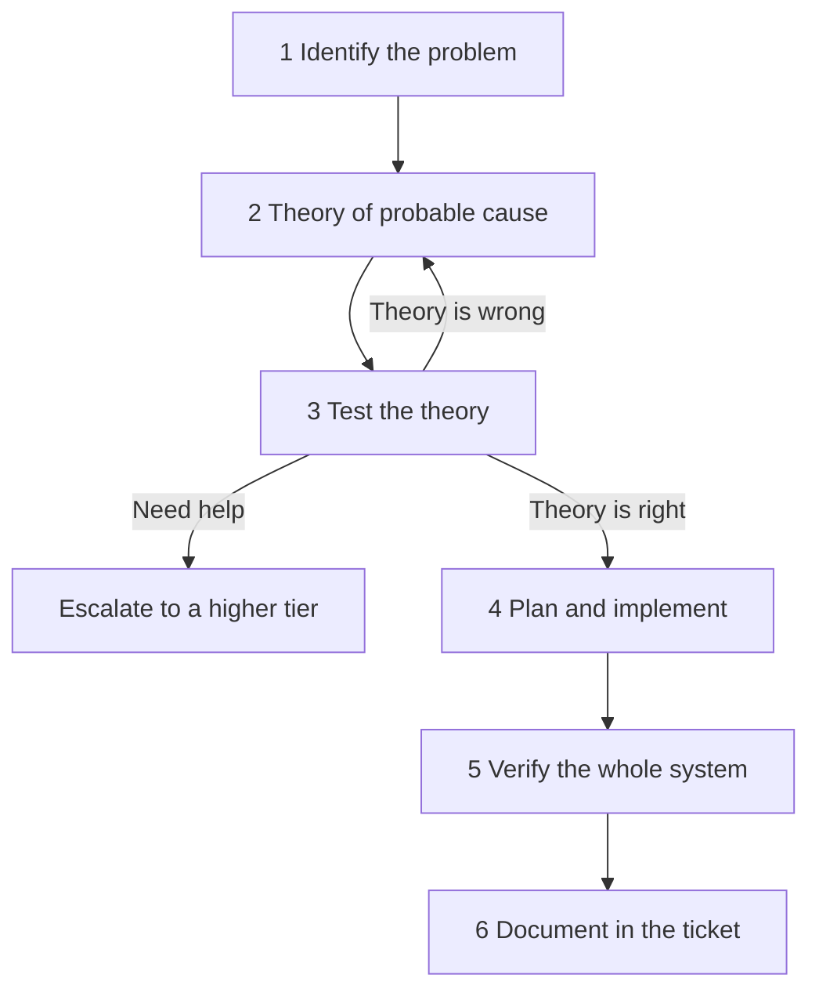

# Troubleshooting methodology (Domain 5)

A fixed order of steps so you do not guess randomly. Core 1 may not ask you to recite the list, but scenario questions still follow it.

1. **Identify the problem** — What is broken versus what should happen? What changed? Reproduce if it is safe. Get error text, beep codes, logs. Back up before you change anything. Change one thing at a time.
2. **Establish a theory of probable cause** — Start with likely causes, not every possible one. Check the obvious (power, cable, input selected).
3. **Test the theory** — Prove or kill the theory quickly. If you cannot, **escalate** (hand the job to a more skilled or authorised person: Tier 1 help desk → Tier 2 → Tier 3 / vendor).
4. **Plan of action and implement** — Repair, replace, or use a workaround. Get approval if users will go offline.
5. **Verify full system functionality** — Confirm the original symptom **and** nearby features. Add a preventative step if you can.
6. **Document** — Ticket: what you saw, what you did, result. Builds a knowledge base and shows how much work the desk is doing.
