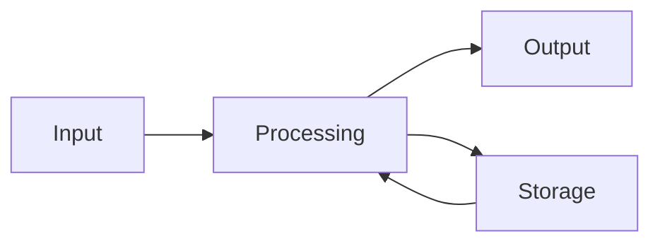

# Introduction (Core 1)

From the yellow tab **Core 1 Introduction** plus safety and the six-step method.

## Four main functions of a PC

| Function | Meaning |
|----------|---------|
| **Input** | Data comes in (keyboard, mouse, touch, scanner, mic) |
| **Processing** | The processor works on that data |
| **Storage** | Data is kept (memory for now, disk for later) |
| **Output** | Result goes out (screen, printer, speakers) |

## Three things a PC needs

- **Hardware** — the physical parts you can touch.
- **Software** — programs that run on the hardware.
- **Firmware** — “software in a chip.” Code baked into a hardware part (BIOS/UEFI, printer engine, SSD controller).

### Three types of software

1. **Operating system** — Windows, macOS, Linux, Android, iOS.
2. **Application software** — Word, Chrome, games.
3. **Drivers** — tiny programs that teach the operating system how to talk to a specific device.

## Safety for a technician

Four areas:

1. **Personal safety** — you (lifts, heat, sharp edges, eyes).
2. **Component safety** — the parts you are repairing.
3. **Electrical safety** — mains, capacitors, unplug first.
4. **Chemical safety** — toner, batteries, solvents.

Trip hazards: route cables through drop ceilings, under raised floors, or in cable trays — not across a walkway.

Biggest threat to parts: **ESD** (electrostatic discharge). Use a mat and wrist strap. One spark can kill a board with no visible mark.

## Six-step troubleshooting method

1. Identify the problem.
2. Establish a theory of probable cause.
3. Test the theory to find the cause.
4. Make a plan and apply the fix.
5. Verify the whole system works (and prevent it happening again if you can).
6. Document findings, actions, and outcomes.
