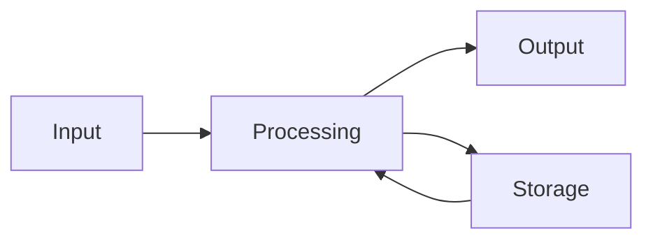

# Introduction (Core 1)

From the yellow tabs **Core 1 Introduction**, **Safety**, and **Troubleshooting Methodology**.

## Four main functions of a PC

| Function | Meaning |
|----------|---------|
| **Input** | Data comes in (keyboard, mouse, touch, scanner, mic) |
| **Processing** | The processor works on that data |
| **Storage** | Data is kept (memory for now, disk for later) |
| **Output** | Result goes out (screen, printer, speakers) |

## Three things a PC needs

- **Hardware** — the physical parts you can touch.
- **Software** — programs that run on the hardware.
- **Firmware** — “software in a chip.” Code baked into a hardware part (BIOS/UEFI, printer engine, SSD controller).

### Three types of software

1. **Operating system** — Windows, macOS, Linux, Android, iOS.
2. **Application software** — Word, Chrome, games.
3. **Drivers** — tiny programs that teach the operating system how to talk to a specific device.

## Safety for a technician

Four areas: personal, component, electrical, chemical.

Trip hazards: route cables through drop ceilings, under raised floors, or in cable trays.

Biggest threat to parts: **ESD** (electrostatic discharge). Use a mat and wrist strap.

**Back up data** before you change files or infrastructure.

## Six-step troubleshooting method

1. **Identify the problem.** What is actually failing? Gather symptoms. Ask what changed. Ask what they already tried (do not repeat the same failed step blindly).
2. **Establish a theory of probable cause.** List likely causes, pick the most probable. Research. Physical check (cables, seating). Unlikely ideas last.
3. **Test the theory.** Change **one** variable. Confirmed → go fix. Not confirmed → new theory and test again. If you lack skill or access, **escalate**. Stuck after several theories → escalate (do not guess forever).
4. **Plan of action and implement.** Repair, replace, or workaround. Plan downtime. Get approval if policy says so. Follow vendor steps.
5. **Verify full system functionality.** Confirm the original symptoms are gone. Check the rest of the system. Confirm services after a reboot. Add prevention where it makes sense.
6. **Document findings.** Record symptoms, cause, and what you did. Use the ticket system on long jobs. Feed the knowledge base. Tickets also show workload if you need more staff or training.

Stick to the plan. Do not skip identify → theory → test.
