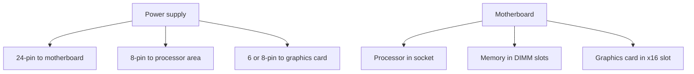

# Motherboards and processors

The **motherboard** is the main circuit board. The **CPU** (central processing unit) is the processor that runs instructions.

## Processor features

- A **thread** is one stream of instructions from a program.
- **SMT** (simultaneous multithreading), Intel name **Hyper-Threading**: one physical core pretends to be two logical processors so idle parts of the core can work on a second thread.
- **SMP** (symmetric multiprocessing): two or more physical processor packages sharing memory (servers).
- **Multi-core**: several cores in one chip (dual, quad, and so on).
- **Virtualization support**: Intel **VT-x** (Virtualization Technology) or AMD **AMD-V**. **SLAT** (second-level address translation) — Intel **EPT** (extended page tables) / AMD **RVI** (rapid virtualization indexing) — makes guest memory faster. Turn it on in firmware.

## Processor families

| Family | Meaning | Memory limit idea |
|--------|---------|-------------------|
| **x86** | 32-bit Intel-style | About 4 gigabytes of memory |
| **x64** | 64-bit | Far more memory; can still run 32-bit programs |
| **ARM** | Reduced instruction set, low power | Phones, Apple Silicon. A virtual machine on ARM normally needs an ARM guest system. |

## Board parts you will see

- **CPU socket** (example AM4) with a **ZIF** (zero insertion force) lever — you should not force the chip in.
- **DIMM** (dual inline memory module) slots for system memory.
- Power: **24-pin ATX** (main board power) and **8-pin EPS** (extra processor power).
- Storage: **SATA** (Serial ATA cables to disks) and **M.2** (small stick slots on the board).
- **PCIe** (Peripheral Component Interconnect Express) slots: **x16** for a graphics card, **x1** for a small card.
- Front-panel headers (power button, USB), **CMOS** battery (keeps firmware clock/settings), rear ports (USB, video, network, audio).

## Expansion cards

- **x16** slot: graphics card. Powerful cards need extra **6-pin or 8-pin PCIe power** from the power supply.
- **x1** slot: capture card, sound, extra network — usually powered by the slot.
- Older: **PCI**, **AGP** (Accelerated Graphics Port), **mini-PCIe** in laptops.

Install: use an **ESD** (electrostatic discharge) strap, seat the card fully, screw the metal bracket where the blanking plate was.

