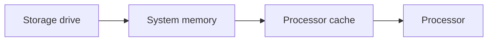

# System memory (Objective 3.3)

**RAM** (random access memory) is fast, temporary workspace. Power off and the contents vanish (**volatile**).

Path of data: disk → RAM → small **CPU cache** → processor.

Office PCs often need about 16 gigabytes; gaming or servers 32 gigabytes or more.

## How much memory the processor can address

- **32-bit / x86:** about **4 gigabytes** usable.
- **64-bit / x64:** vastly more (the operating system and board still set a real cap).

## Module generations

**DDR** = double data rate (sends data on both edges of the clock). DDR3, DDR4, and DDR5 are **not** interchangeable — the notch is in a different place.

**SODIMM** (small outline dual inline memory module) = laptop stick. Desktop uses longer **DIMM** sticks.

If you mix speeds, all sticks run at the **slowest** speed.

| Generation | Rough bandwidth | Typical max per stick (course ballpark) |
|------------|-----------------|------------------------------------------|
| DDR3 | About 6.4–17 gigabytes per second | About 8 gigabytes |
| DDR4 | About 12.8–25.6 gigabytes per second | About 32 gigabytes |
| DDR5 | About 38–51+ gigabytes per second | About 128 gigabytes |

## Multi-channel memory

Two matched sticks in the slots the manual marks (often the second and fourth, or A2/B2) open a **dual-channel** path — twice the width of one stick. Triple and quad channel exist on higher-end boards.

## Error checking

- **Non-parity:** normal home memory. No extra check bit.
- **Parity:** can **detect** a flipped bit, not fix it.
- **ECC** (error-correcting code): can detect and **correct** small errors. Common on servers. Do not mix ECC and non-ECC. DDR5 chips often have **on-die ECC** inside the chip; that is not the same as module-level ECC.

## Virtual memory

When RAM is full, the operating system parks cold pages on disk: **page file** (Windows) or **swap** (Linux). Pages are often 4 kilobytes. Heavy use of the page file is much slower than real RAM.

## Install

Use an electrostatic discharge strap. Desktop DIMM: push straight down until the side clips lock. Laptop SODIMM: often insert at about 45 degrees, then press flat.
