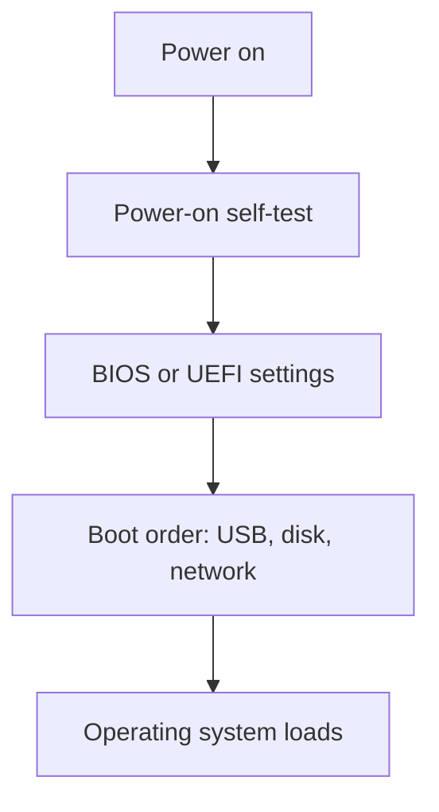

# Firmware: BIOS and UEFI (Objective 3.5)

Firmware is the small program on the motherboard that starts before Windows or Linux.

| | **BIOS** (Basic Input/Output System) | **UEFI** (Unified Extensible Firmware Interface) |
|--|--------------------------------------|--------------------------------------------------|
| Screen | Text, keyboard only | Graphics, mouse |
| Disk table | **MBR** (master boot record), disks about 2.2 terabytes max | **GPT** (GUID partition table), huge disks |
| Extra | Beep codes after **POST** (power-on self-test) | **Secure Boot**, better tools |

Makers still label the screen “BIOS.” Enter with Delete or F2 (varies).

## Boot and disks

Boot order: USB stick, optical drive, hard disk / solid-state drive, **PXE** (Preboot Execution Environment — boot from the network).

**Secure Boot** checks that firmware and the boot loader are signed, so malware cannot easily replace the starter code.

SATA mode: **AHCI** (normal single disks) versus **RAID** (several disks acting as one).

## Passwords

- Supervisor / setup password: stops people changing firmware settings.
- User / system password: asked before the machine boots.
- Hard-disk password: the drive itself will not unlock without it.

A **CMOS battery** keeps clock and some settings. Pulling it often clears settings; it may **not** clear a drive password.

## Trusted chips

**TPM** (Trusted Platform Module): small crypto chip. Stores keys, measures boot (**PCRs** — platform configuration registers), used by **BitLocker**-style disk encryption.

**HSM** (hardware security module): a dedicated box for keys, used in bigger environments.

Also in firmware: fan curves, temperature readout, Hyper-Threading, ECC if the board supports it, sleep/hibernate (**ACPI** — Advanced Configuration and Power Interface). Flash (update) firmware only with good power and the correct file.
