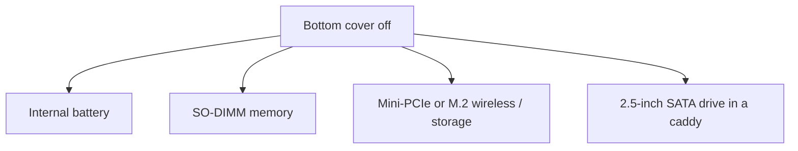

# Laptop hardware (Objective 1.1)

**Given a scenario:** watch laptop hardware and replace parts the right way.

Corporate laptops are often thicker with easy doors (battery, drive, wireless). Thin / gaming laptops usually need the whole bottom cover off.

## Security parts on the laptop itself

- **Biometric sensor:** unique body feature used as a login factor. Common: fingerprint in the power button; face scan with the webcam (**Windows Hello**). USB add-on scanners exist if the laptop has none.
- **NFC** (near-field communication) scanner: very short range. On laptops it is mostly for pairing (AirPods near a Mac). Payments usually need a USB NFC reader on a till.
- **Kensington lock / security slot:** small hole on the side. A steel cable locks the laptop to a desk. Key or combination unlock. Used in offices and demo stands, not cafes.
- **Smart-card reader** (some business models): ID card + PIN = something you have + something you know.

## Safe teardown

- Work on an **ESD** (electrostatic discharge) mat. Wear a wrist strap when the cover is off.
- Use a **magnetic parts tray** and label every screw (top-left, centre, and so on). Wrong-length screws crack the board.
- Plastic pry tool for clips. Do not yank ribbon cables.
- Photograph each stage. Check the service manual — Apple and many ultrabooks solder memory and storage.
- Hardware Wi-Fi switch: if wireless is dead, check the physical slider or **Fn + airplane** key first.

## Battery

Older business units: slide locks, pull the pack, slide a new one until it clicks.

Modern units: internal pack on a connector. Disconnect the battery **before** other work so you do not short the board. Buy the exact model pack. After install, confirm charge and that the system sees the new battery.

## Keyboard and trackpad

- Keyboards and trackpads are **model-specific**. A 2022 MacBook Pro keyboard does not fit a 2018.
- Compact keyboards hide a number pad on letter keys. If letters type as numbers, turn **Num Lock** off.
- Trackpad: older units have separate left/right buttons; newer ones use one-finger / two-finger click or bottom-left / bottom-right zones.
- Single key cap: pry the cap, check the retainer clip, snap a new cap on.
- Full keyboard on a glued modern laptop can take 1–2 hours (and sometimes soldering). On a laptop older than about two years, a new machine can be cheaper than labour.
- Display toggle is often **Fn + a function key** (example F7). Airplane mode is another Fn key.

## Memory — SO-DIMM

**SO-DIMM** (small-outline dual inline memory module) = laptop stick. Insert at about **45 degrees**, then press flat until the side clips lock. Notch only fits one way.

Dual-channel: two matched sticks (same size and speed, ideally a kit). Two 8-gigabyte sticks = 16 gigabytes with a wider data path.

Some laptops have one stick soldered and one slot free. Read the manual before you buy. Memory is one of the cheapest speed upgrades if the machine is not soldered.

## Expansion cards (wireless / cellular)

Usually **mini-PCIe** or a small **M.2** card.

1. Note which antenna colour goes to which arrow on the card.
2. Pull antenna buttons **straight up** with tweezers — do not yank the cable (you will tear the antenna that runs around the lid).
3. Remove the holding screw; the card springs to about 45 degrees; slide out.
4. New card in at 45 degrees, screw down, reconnect antennas, tape the cables back.

No antenna = a few feet of range instead of tens of metres.

## Storage

- **M.2 / short PCIe SSD** (solid-state drive): looks a bit like a wireless card. One screw, pops to 45 degrees, slide out. Keying (notches) must match the slot. Newer machines use a full-length M.2 slot.
- **2.5-inch SATA** (Serial ATA) hard disk: four screws into a caddy, then a SATA data + power plug or a tiny **ZIF** (zero insertion force) ribbon adapter. The drive itself is a normal 2.5-inch SATA disk — it will work in a USB dock on a desktop.

**Always back up first.** A new SSD is empty. Mechanical disks can be read later in an external USB caddy; some NVMe sticks need a matching enclosure.

Hybrid laptops: fast SSD for the operating system, spinning disk for bulk video.
