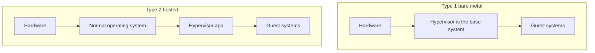

# Virtualization (Objective 4.1)

**Virtualization** = one physical computer runs several isolated **virtual machines**. Each virtual machine thinks it has its own processor, memory, disk, and network card.

- **Host** = the real machine plus the **hypervisor** (the software that splits the hardware).
- **Guest** = the virtual machine and its own operating system.

## Two hypervisor types

| Type | Where it sits | Examples | Note |
|------|---------------|----------|------|
| **Type 1** bare metal | Directly on the hardware | ESXi / vSphere, Hyper-V Server, Xen | Faster; used on servers |
| **Type 2** hosted | An app on Windows, macOS, or Linux | VirtualBox, VMware Workstation, Parallels | Easier on a laptop; extra overhead |

**Application virtualization:** the program runs on a server and you view it with **RDP** (Remote Desktop Protocol), or the program is streamed in a sandbox on your PC.

## Containers

A **container** shares the host **kernel** (the core of the operating system) and only packs the app plus its libraries. **Docker** and **Kubernetes** are common tools.

Uses less disk and memory than a full virtual machine. Starts in seconds. Containers do not talk to each other unless you build a virtual network.

Risk: if the shared host system is broken into, every container on that host is at risk.

## Why virtual machines exist

Pack many servers on one box (less power and cooling). Snapshots and labs. **Sandbox** to run malware safely. **VDI** (virtual desktop infrastructure) — your desktop runs in the data centre. Test Windows and Linux on one laptop **if the processor family matches**.

**Virtualization versus emulation:** virtualization needs the same processor type as the host. **Emulation** translates a different processor (slow), for example an old game console on a PC.

## Resources

Turn on **VT-x** or **AMD-V** and **SLAT** in firmware. Leave enough memory for the host **plus** every running guest. Each virtual machine is files on disk (**thin** provision grows as used; **thick** uses the full size now). Network modes: **NAT** (easy internet), **bridged** (looks like another machine on the LAN), **host-only** (lab isolation).

A 64-bit host can run 32-bit or 64-bit guests. A 32-bit host cannot run 64-bit guests.

## Security words to know

- **VM escape:** guest breaks out to the hypervisor or host.
- **VM hopping:** guest jumps to another guest on the same host.
- **Sandbox escape:** code leaves a browser or app jail.
- **VM sprawl:** forgotten virtual machines that never get patches.
- Encrypt live moves and disks. Turn off shared clipboard and shared folders unless you need them.
