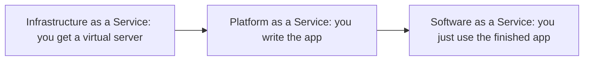

# Cloud computing (Objectives 4.1 and 4.2)

**Cloud computing** = using remote servers on the internet instead of only boxes in your building.

## Characteristics

- **Shared versus dedicated hardware:** apartment (cheaper, isolated by software) versus house (reserved gear, used for regulated data).
- **Metered / pay-as-you-go:** billed for hours, storage, and especially **egress** (data leaving the cloud). **Ingress** (data in) is often free.
- **Elasticity:** grow extra servers when busy, shrink when quiet.
- **High availability:** copies in more than one place. An **SLA** (service level agreement) might promise 99.9% uptime.
- **File sync:** same file on laptop and phone.
- **Multitenancy:** many customers on one physical plant, kept logically apart.

## Deployment models

| Model | Who uses the plant |
|-------|--------------------|
| **Public** | Anyone can buy (Amazon Web Services, Microsoft Azure, Google Cloud) |
| **Private** | One organisation only (example: a government cloud) |
| **Hybrid** | Private for secrets + public for extra load |
| **Community** | Several organisations with the same need share one cloud |

## Service models (who patches what)

- **IaaS** (Infrastructure as a Service): you get virtual machines, disks, and network. You install and patch the operating system and apps (example: Amazon **EC2**).
- **PaaS** (Platform as a Service): provider runs the operating system and runtime. You write application code and data.
- **SaaS** (Software as a Service): finished product in a browser (Microsoft 365, Google Workspace).

Exam hint: more than a raw server but less than a finished app → usually Platform as a Service.

## Virtual desktop infrastructure (VDI) / Desktop as a Service (DaaS)

The desktop operating system runs in a data centre. Your laptop or thin client is only a window. If the network or the server dies, nobody works. **Non-persistent** desktops are wiped at logoff, which throws away malware.

## Cloud storage

Google Drive, OneDrive, Dropbox. **CDN** (content delivery network) copies files to edge servers near users so video does not travel from one distant origin.

## Small cloud lab pattern (Amazon Lightsail style)

Pick a region close to you → Linux is cheaper than Windows → operating system only (Infrastructure as a Service) or app plus operating system → pick plan size → connect with **SSH** (Secure Shell). Use snapshots as backups. Delete the instance when you finish so billing stops.
