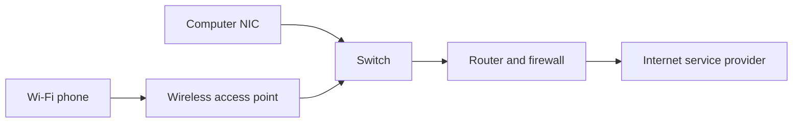

# Networking basics (Objectives 2.3, 2.5, 2.7, 2.8, 3.2)

A **network** is any path that lets devices exchange data. Today one **converged** network carries voice, video, and data. Many organisations aim for **five nines** availability: 99.999% uptime (about five minutes down per year).

## Hardware boxes

- **NIC** (network interface card): the port or radio that joins a PC to the network. Copper **RJ45**, fibre, or Wi-Fi. On the board, as a card, or USB.
- **Hub** (old): copies every frame to every port. One **collision domain** (two speakers talk at once and both must retry). Anyone on the hub can see traffic. 10 or 100 megabits only.
- **Switch**: learns which **MAC** (Media Access Control) address sits on which port and sends a frame only there. **Unmanaged** = plug in and go. **Managed** = virtual LANs, 802.1X login, address filters.
- **WAP** (wireless access point): turns radio into Ethernet so Wi-Fi devices join the wired network.
- **Router**: forwards between networks using **IP** (Internet Protocol) addresses. A home box often combines modem + router + switch + Wi-Fi + firewall.
- **Firewall**: rules (**ACL** — access control list) that allow or block traffic. A **UTM** (unified threat management) box adds antivirus and spam filtering.
- **Patch panel**: wall cables end here; cheap short patch leads go to the switch so you do not wear out expensive switch ports.
- **PoE** (Power over Ethernet): power and data on one cable.
  - 802.3af ≈ 15 watts class
  - 802.3at PoE+ ≈ 25–30 watts
  - 802.3bt PoE++ ≈ 51 watts or more
  Use a **power injector** if the switch has no PoE. Prefer Category 6 cable for higher wattage.
- **Cable modem** / **DSL modem** / **ONT** (optical network terminal): convert the ISP medium into Ethernet.
- **SDN** (software-defined networking): control the network with software instead of clicking each box.

## Network sizes

| Short name | Full name | Size idea | Examples |
|------------|-----------|-----------|----------|
| **PAN** | Personal area network | Arms reach | Bluetooth, USB |
| **LAN** | Local area network | Building or floor | Office Ethernet or Wi-Fi |
| **MAN** | Metropolitan area network | A city | City offices tied together |
| **WAN** | Wide area network | Country or world | The internet; a private leased line |
| **WLAN** | Wireless local area network | LAN over radio | Home Wi-Fi |
| **SAN** | Storage area network | Fast disk fabric | iSCSI or Fibre Channel in a data centre |

## Internet of Things (IoT)

Everyday objects with sensors and an IP address: lights, heating, cameras, door badges, lab gear, watches.

Pieces: a **hub** (Amazon Echo; often **Zigbee** or **Z-Wave** radios), smart devices, wearables, sensors.

Put IoT on its **own** network or virtual LAN. Attackers have used building-control gear as a door into the business network.

## Twisted-pair copper

Eight wires in four pairs. Twists reduce **EMI** (electromagnetic interference). Official Ethernet copper limit is about **100 metres** including patch cords — plan closer to 70 metres wall-to-closet.

**UTP** (unshielded twisted pair) = cheap and flexible. **STP** (shielded twisted pair) = foil or braid for noisy rooms.

**RJ45** = eight-pin data plug. **RJ11** = smaller phone plug.

**Bandwidth** = rated maximum. **Throughput** = what you actually get after noise and length.

| Category | Common Ethernet name | Speed | Distance note |
|----------|----------------------|-------|----------------|
| Cat 5 | 100BASE-TX | 100 megabits | 100 metres |
| Cat 5e | 1000BASE-T | 1 gigabit | 100 metres |
| Cat 6 | 1000BASE-T or 10GBASE-T | 1 gigabit at 100 metres; **10 gigabit at 55 metres** | |
| Cat 6A | 10GBASE-T | 10 gigabit | 100 metres |
| Cat 7 | 10GBASE-T | 10 gigabit | 100 metres |
| Cat 8 | 40GBASE-T | 40 gigabit | **30 metres** (data centre) |

Jackets: **plenum** (low smoke in air-handling ceilings), **riser** (between floors), **direct bury** (underground).

## Wire colours: T568A and T568B

Hold the plug with the clip down and the pins facing you.

- **T568A:** white-green, green, white-orange, blue, white-blue, orange, white-brown, brown
- **T568B:** white-orange, orange, white-green, blue, white-blue, green, white-brown, brown

Only orange and green swap. Blue and brown stay put.

**Straight-through** = same standard both ends (usually B and B). Use between different device types (computer to switch).
**Crossover** = A on one end, B on the other. Use between two of the same type unless the ports have Auto-MDI-X (most modern ports do).

Memory trick: **A** = alternate / government. **B** = business / common.

## Fibre optic

Light in glass. No electromagnetic interference. Kilometres, not 100 metres.

- **SMF** (single-mode fibre): thin core, usually **yellow** jacket, long distance.
- **MMF** (multimode fibre): thicker core, **aqua or orange** jacket, shorter building runs.

Connectors:
- **SC** — square, push until it clicks.
- **ST** — round, push and twist.
- **LC** — small pair clipped together.
- **MTRJ** — both fibres in one small plastic body.

## Coaxial

- **RG-6:** cable-modem / TV drop. **F-type** screw-on connector.
- **RG-59:** short analog video.
- **BNC:** twist-lock; old Ethernet and some military gear.
- **Twinax / DAC:** short (about 7 metres) high-speed copper between switches.

## Tools

Snips, stripper, **crimper** (presses the plug onto the cable). **Tester** checks continuity. **Wire mapper** finds opens, shorts, reversed or split pairs. **Certifier** proves category and length. **Punch-down** seats wires on a **110** block (data) or **66** block (old phones). **Toner / fox-and-hound** finds the other end of an unlabeled cable. **Loopback** plug ties transmit to receive on a port. **Tap** copies traffic for analysis. **Wi-Fi analyzer** shows channels and coverage.

Cable path in a building: wall jack → hidden cable → patch panel → short lead → switch.
