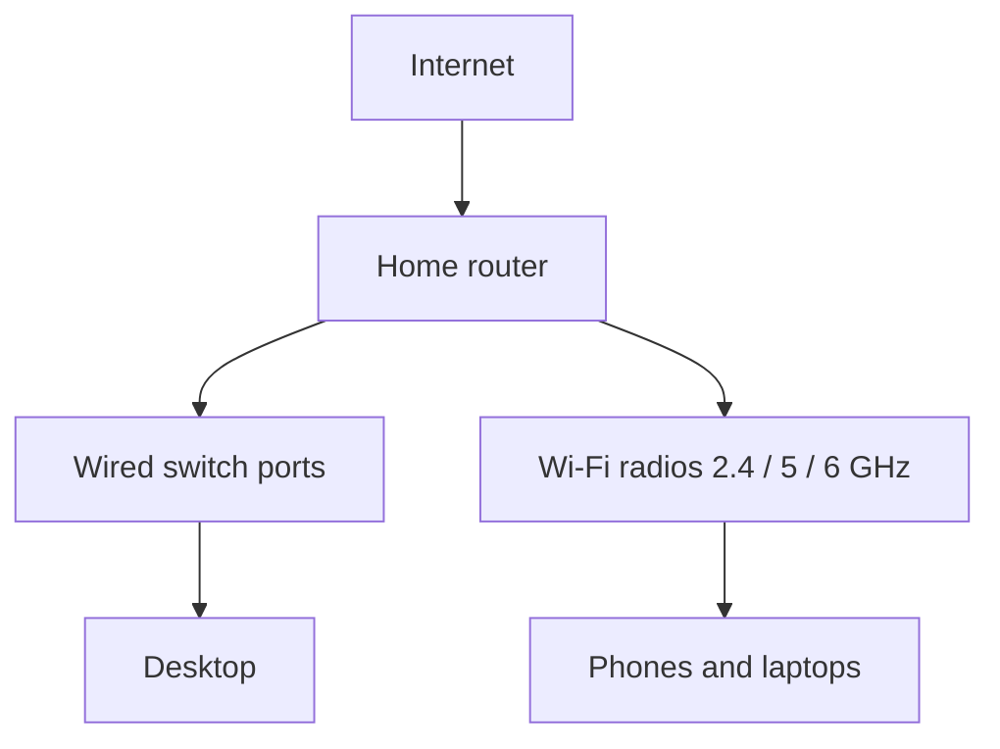

# Wireless networks (Objective 2.2)

## Frequency bands

Think of a band as a range of radio channels.

- **2.4 gigahertz:** longer range, crowded (microwaves, Bluetooth). In the United States use channels **1, 6, and 11** only so they do not overlap.
- **5 gigahertz:** shorter range, more clean channels. You can bond channels to 40, 80, or 160 megahertz wide. Some channels are **DFS** (dynamic frequency selection) because radar also uses them.
- **6 gigahertz:** **Wi-Fi 6E** and newer. Many clean channels, short range.

**DSSS** (direct-sequence spread spectrum) = old 802.11b method. **OFDM** (orthogonal frequency-division multiplexing) = G / N / AC / AX. **OFDMA** = AX sharing one channel among several clients at once.

## 802.11 standards

**IEEE 802.11** is the family name for Wi-Fi.

| Standard | Also called | Band | Rough maximum |
|----------|-------------|------|----------------|
| 802.11a | — | 5 gigahertz | 54 megabits |
| 802.11b | — | 2.4 gigahertz | 11 megabits |
| 802.11g | — | 2.4 gigahertz | 54 megabits |
| 802.11n | Wi-Fi 4 | 2.4 and 5 | 300–600 megabits (**MIMO** = multiple antennas) |
| 802.11ac | Wi-Fi 5 | **5 gigahertz only** | Theory multi-gigabit; often about 1 gigabit in real rooms |
| 802.11ax | Wi-Fi 6, or **6E** if 6 gigahertz is included | 2.4, 5, and maybe 6 | Theory about 9.6 gigabits |

A pure 802.11b adapter cannot join a pure 802.11ac network — wrong band.

## Wireless security (weak to strong)

- **WEP** (Wired Equivalent Privacy): broken. Never use.
- **WPA** (Wi-Fi Protected Access): **TKIP** + old **RC4** cipher. Obsolete.
- **WPA2:** **AES** (Advanced Encryption Standard) with **CCMP**. Home uses a **PSK** (pre-shared key / passphrase). Offices use **802.1X** with a login server.
- **WPA3:** **SAE** handshake instead of the old PSK handshake, **forward secrecy**, **PMF** (protected management frames). Offices can use 192-bit keys. Mixed WPA2/WPA3 while old devices exist.

Also: hide the **SSID** (network name) if the exam asks; **MAC filter** (allow-list of hardware addresses — easy to fake); turn **WPS** (Wi-Fi Protected Setup push-button) **off**; guest network isolated from the home LAN; remote administration from the internet **off**.

## Fixed wireless (not your home Wi-Fi)

- Directional Wi-Fi dish to dish between buildings.
- Fixed **5G** router for a house with no fibre.
- Microwave link, line of sight, up to about 40 miles.
- Satellite: **GEO** (high delay) versus **LEO** such as Starlink (lower delay).

## Short-range radios

- **NFC** (near-field communication): a few centimetres; tap-to-pay. Skimmers exist.
- **RFID** (radio-frequency identification): badges and stock tags. Pair with a PIN against relay attacks.
- **IR** (infrared): line-of-sight remotes; slow.
- **Bluetooth:** 2.4 gigahertz personal area network. Risks: **bluejacking** (spam messages), **bluesnarfing** (steal data), **BlueBorne** (take-over without pairing). Turn off “discoverable” when you are not pairing.
- **Tethering:** phone shares its cellular data over Wi-Fi, Bluetooth, or USB.

