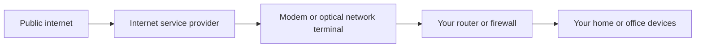
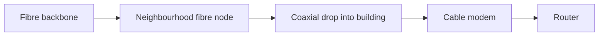
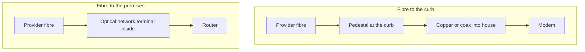
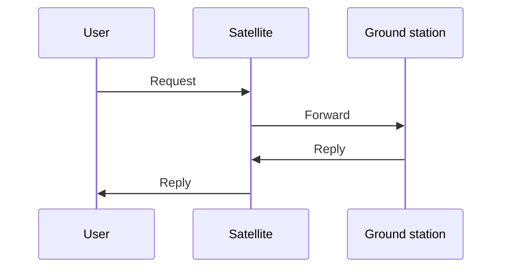

# Internet connections (Objective 2.7)

CompTIA says **internet connection types**. Technicians often say **WAN** (wide area network) connections. A wide area network is a link that leaves your building and reaches another site or the public internet.

To get the link you sign a contract with an **ISP** (internet service provider). The provider brings a cable or radio path to your building. A box at your wall converts that path into Ethernet your router can use.

---

## Dial-up (oldest phone-line internet)

Uses the **PSTN** (public switched telephone network), also called **POTS** (plain old telephone service) — the analog voice phone system.

A **modem** (modulator / demodulator) turns computer bits into audio on the phone line, and the other end turns the audio back into bits. You hear the classic handshake tones.

- Top speed about **53.3 kilobits per second** (a phone channel is 64 kilobits; some is used for signaling).
- Too slow for video, games, or big files.
- Still seen on a few legacy machines.

---

## DSL — digital subscriber line

Same copper phone pair as dial-up, but it uses **higher frequencies** so you can use the internet and talk on the phone at the same time.

The provider ends the line at a **DSLAM** (digital subscriber line access multiplexer) in the telephone building. Distance to that box limits speed.

| Type | Full name | Idea | Typical speeds from the course |
|------|-----------|------|--------------------------------|
| **ADSL** | Asymmetric digital subscriber line | Download much faster than upload (normal home use) | About 8 megabits down / 1.5 megabits up |
| **SDSL** | Symmetric digital subscriber line | Same speed both ways (older business use) | About 1.5 megabits both ways |
| **VDSL** | Very-high-bit-rate digital subscriber line | Fastest DSL, but you must be close to the DSLAM | Up to about 50 megabits down / 10+ up; within about **4,000 feet** of the DSLAM |

ADSL can work out to about **18,000 feet** from the DSLAM, but much slower. Cable, fibre, 5G, and satellite have mostly replaced DSL except where nothing else exists.

---

## Cable internet

Uses the cable-TV plant.

**HFC** (hybrid fibre-coaxial): fibre carries the signal to the neighbourhood; **coaxial cable** (the round TV cable) is the last stretch into the building. A **cable modem** turns radio-frequency on coax into Ethernet.

**DOCSIS** (Data Over Cable Service Interface Specification) is the rule set so any brand of cable modem can talk to the provider. You do not need the exact frequencies for the exam — just pair **DOCSIS** with **cable modem**.

DOCSIS 4.0 can theoretically reach about 10 gigabits down and 6 gigabits up. Cable beat DSL because the TV network was already in most streets.

---

## Fibre internet

Light in glass. Fastest and most stable of the common home options.

| Short name | Full name | Where the glass stops |
|------------|-----------|------------------------|
| **FTTC** | Fibre to the curb | Pedestal at the street. Last metres are still copper or coax into a modem. |
| **FTTP** / **FTTH** | Fibre to the premises / fibre to the home | Glass comes all the way inside the building. |

**ONT** (optical network terminal): box that turns light into electricity. Then a copper patch cable goes to your router. FTTP can give **symmetric** 1 gigabit (same upload and download) — useful if you upload large files.

---

## Cellular (phone-network internet)

A **cellular modem** in a phone, tablet, hotspot, or office router talks to a radio tower.

**G** means **generation**. Higher G = newer and faster. You do not need every historic speed for the exam.

| Generation | What to remember |
|------------|------------------|
| 1G | Voice only |
| 2G | First useful data + text messages. **GSM** = Global System for Mobile Communications. Speeds like old dial-up. **EDGE** (Enhanced Data rates for GSM Evolution) later reached about 1 megabit. |
| 3G | Usable mobile web. **WCDMA**, **HSPA**, **HSPA+** are faster 3G flavours. |
| 4G / **LTE** (Long-Term Evolution) | Everyday broadband on a phone. **LTE-A** (LTE Advanced) is faster LTE. Uses **MIMO** (multiple-input multiple-output) — several antennas at once. |
| 5G | Current. Three radio **bands** (see below). |

### 5G bands (exam-useful)

| Band | Frequency idea | Speed vs coverage |
|------|----------------|-------------------|
| Low-band | About 600–850 megahertz | Wider coverage, slower (tens to a few hundred megabits) |
| Mid-band | About 2.5–3.7 gigahertz | Best everyday balance |
| High-band / millimetre wave | About 25–39 gigahertz | Multi-gigabit in a small area (stadiums). Blocked easily by walls. |

A phone can also be a **hotspot**: it uses cellular toward the internet and shares Wi-Fi with your laptop.

---

## WISP — wireless internet service provider

A **microwave** radio link between two fixed dishes (not a kitchen microwave). Frequencies from hundreds of megahertz up into gigahertz.

- Needs **line of sight** (nothing blocking the path).
- Practical reach about **40 miles / 64 kilometres** because of the horizon.
- Campus or business-park buildings often use this instead of digging fibre.
- Older consumer brand: **WiMAX** (Worldwide Interoperability for Microwave Access), standard **IEEE 802.16**. 4G/5G phones made rooftop WiMAX less common for homes.

---

## Satellite

A dish talks to a spacecraft. Works anywhere with a view of the sky (farms, ships, planes, RVs).

| Orbit | Height idea | Coverage | Delay (latency) |
|-------|-------------|----------|-----------------|
| **GEO** geosynchronous | About 22,000 miles up | One satellite covers a huge slice of Earth | Round trip often about **500 milliseconds** — fine for video, painful for games and calls |
| **LEO** low Earth orbit (example: Starlink) | A few hundred miles up | Each satellite covers a small patch, so you need **thousands** of them | About **30–35 milliseconds** — much closer to cable |

**Latency** = how long a packet takes to go and come back. GEO has a long flight path: user → satellite → ground station → satellite → user.

---

## What the wall box looks like in real life

You usually see one combo box: modem + router + Wi-Fi + a few switch ports.

- **Cable / some fibre installs:** coax in, Ethernet out.
- **True fibre:** Ethernet or a special fibre jack into an optical network terminal, then Ethernet to your router.
- **Satellite:** coax up to the roof dish, Ethernet out to you.
- **Cellular:** phone hotspot, or a dedicated outdoor antenna + indoor router.

## Exam comparison snapshot

| Type | Medium | Speed class | Watch-outs |
|------|--------|-------------|------------|
| Dial-up | Analog phone | Kilobits | Almost unused |
| DSL | Phone copper | Low megabits | Distance to the telephone box |
| Cable | Hybrid fibre + coax | High megabits to gigabits | Shared neighbourhood plant |
| Fibre | Glass | Gigabits, often equal up and down | Needs an optical network terminal |
| Cellular | Radio to a tower | Depends on generation and band | Signal and data caps |
| WISP / microwave | Point-to-point radio | Up to about 1 gigabit | Line of sight, weather |
| Satellite | Space radio | Varies | GEO delay; LEO needs a clear sky |
