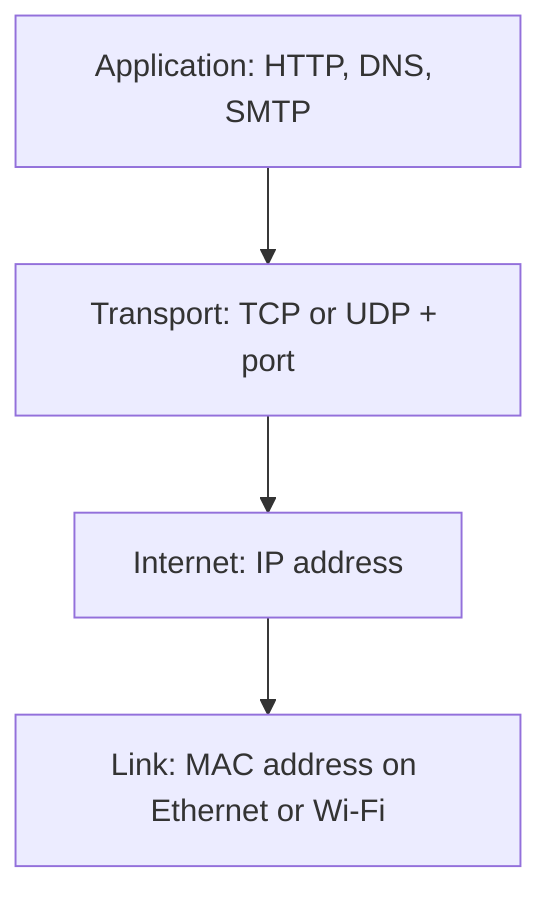
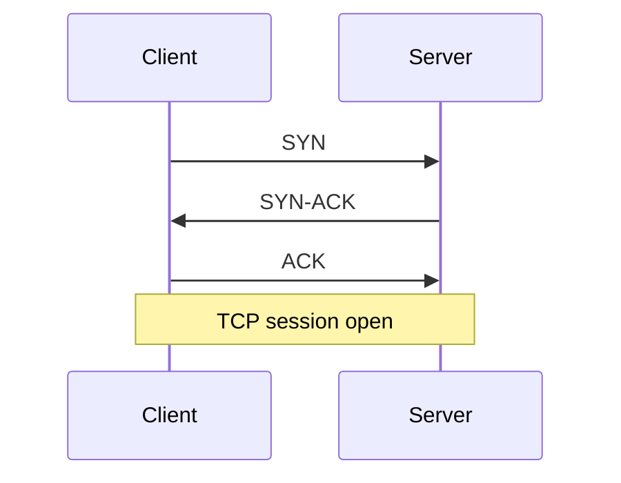

# Network addressing and communication (Objectives 2.1 and 2.6)

**TCP/IP** (Transmission Control Protocol / Internet Protocol) is the rule set the internet uses. Four layers in the TCP/IP model:

1. **Link / network interface** — frames on cable or Wi-Fi. Stays on the local network.
2. **Internet** — **IP** addresses and routing across networks.
3. **Transport** — **how** to send: TCP (reliable) or UDP (fast).
4. **Application** — what the data is for (web, mail, file copy).

## IPv4 — Internet Protocol version 4

32 bits. Written as four **octets** (8-bit chunks) in dotted decimal, each 0–255. Example: `192.168.1.4`.

About **4.3 billion** addresses — not enough, so we use **private** ranges plus **NAT** (network address translation): many home devices share one public address on the router.

**Subnet mask** is not an address. It marks which bits are the **network** (ones) and which are the **host** (zeros). `255.255.255.0` means the first three octets are the network. Two PCs with `192.168.1.4` and `192.168.1.50` and that mask are on the same LAN and talk through a switch. `192.168.2.10` is a different network and needs a router.

## Classful versus classless

Old **classful** split by first octet:

| Class | First octet | Default mask | Typical use |
|-------|-------------|--------------|-------------|
| A | 1–127 | 255.0.0.0 | Huge orgs |
| B | 128–191 | 255.255.0.0 | Medium |
| C | 192–223 | 255.255.255.0 | Small office / home |
| D | 224–239 | (none) | **Multicast** |
| E | 240–255 | (none) | Experimental |

Each subnet reserves two addresses: network ID and broadcast. A /24 has 256 numbers and **254** usable hosts.

**CIDR** (Classless Inter-Domain Routing, said “cider”): you pick the prefix length. `192.168.1.0/24` = 24 network bits. You can carve a Class A into many /24s so you do not waste millions of addresses. **Supernet** = glue small blocks into a bigger advertisement.

## IPv6 — Internet Protocol version 6

128 bits. Eight groups of four **hex** digits: `2001:0db8:0000:0000:0000:0000:2a4e:0370`.

Shorthand: drop leading zeros in a group; use **one** `::` to hide a run of zero groups. Same address: `2001:db8::2a4e:370`.

| Type | How you spot it | Job |
|------|-----------------|-----|
| Global unicast | First group 2000–3fff | Public, like a public IPv4 |
| Link-local | Starts **fe80** | Same cable only. Every IPv6 interface gets one. **SLAAC** (stateless address autoconfiguration) builds it from the MAC using **EUI-64**. |
| Multicast | Starts **ff** | One-to-many |
| Anycast | Looks like unicast | Deliver to the **nearest** of a group |

## Ports

A **port** is a numbered door on an IP address (0–65535).

- Server **inbound** well-known port stays open (web = 443).
- Client picks a high **outbound** port for that session, then closes it.

| Range | Name |
|-------|------|
| 0–1023 | Well-known (IANA standard services) |
| 1024–49151 | Registered (vendor apps) |
| 49152–65535 | Dynamic / private (temporary clients) |

## Ports to memorise for Core 1

| Port(s) | Protocol | What it does |
|---------|----------|----------------|
| 20, 21 | **FTP** File Transfer Protocol | File copy; 21 control, 20 data; clear text |
| 22 | **SSH** Secure Shell | Encrypted remote command line |
| 23 | **Telnet** | Remote command line in **clear text** — replace with SSH |
| 25 | **SMTP** Simple Mail Transfer Protocol | Send mail |
| 53 | **DNS** Domain Name System | Name to address |
| 67, 68 | **DHCP** Dynamic Host Configuration Protocol | Automatic IP |
| 80 | **HTTP** Hypertext Transfer Protocol | Web, no encryption |
| 110 | **POP3** Post Office Protocol 3 | Download mail |
| 143 | **IMAP** Internet Message Access Protocol | Mail stays on server |
| 137, 139 | **NetBIOS / NetBT** | Old Windows name + session |
| 389 | **LDAP** Lightweight Directory Access Protocol | Directory (Active Directory) |
| 443 | **HTTPS** HTTP Secure | Encrypted web |
| 445 | **SMB / CIFS** Server Message Block / Common Internet File System | Windows file and printer share |
| 3389 | **RDP** Remote Desktop Protocol | Remote Windows screen |

Encrypted mail ports (from the mobile module): IMAP 993, POP3 995, SMTP 465.

## TCP versus UDP

**TCP** (Transmission Control Protocol): connection-oriented. **Three-way handshake:** SYN → SYN-ACK → ACK. Every chunk is acknowledged; lost data is sent again. Use for web, mail, file copy, SSH.

**UDP** (User Datagram Protocol): fire-and-forget. No handshake, no retry. Use for live video, games, DNS lookups, DHCP. Missing a frame is better than pausing to resend.

