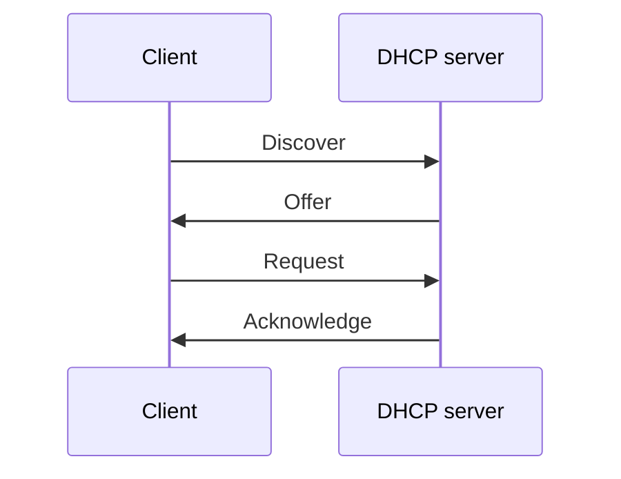
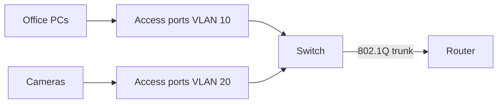

# Network configurations (Objectives 2.4, 2.6)

Yellow tab: **Network Configuration**.

Explain common config ideas: **DHCP**, **DNS** (including mail-auth records), **VLANs**, **VPNs**. One wrong digit in IP, mask, gateway, or DNS can kill connectivity.

## DHCP — Dynamic Host Configuration Protocol

Hands out settings so you do not type them on every host:

- IPv4 (and IPv6) address
- Subnet mask
- Default gateway
- DNS server address

**Scope** = pool the server may lease (example `192.168.1.11`–`254`).

**Lease** = temporary assignment. Home often ~24 hours; enterprise often 7–30 days. Client renews before expiry. Address returns to the pool when the lease ends.

**Reservation** = bind a **MAC** (Media Access Control) address to a fixed IP on the DHCP server. The device always gets that IP without a static config on the NIC.

**Static IP** = typed on the device itself. Use for core gear when you do not want a DHCP dependency. Reservations are usually cleaner on large networks.

### DORA

1. **Discover** — “Is there a DHCP server?”
2. **Offer** — server offers an address from the scope.
3. **Request** — client asks to use that offer.
4. **Acknowledge** — server confirms the lease and sends mask / gateway / DNS.

If DHCP fails:

- Default fallback **APIPA** (Automatic Private IP Addressing) `169.254.0.0/16`. Local LAN only; not routed to the internet.
- Some orgs set a custom static fallback instead of APIPA.

Routers do not forward DHCP shouts. A **relay** (IP helper) forwards them to a server on another subnet.

## DNS — Domain Name System

Translates names → IP addresses.

Hierarchy (top → bottom):

1. Root (`.`)
2. **TLD** (top-level domain): `.com`, `.net`, `.uk`, …
3. Second-level domain (`diontraining`)
4. Subdomain (`www`, `mail`)
5. Host (`web01.www…`)

**FQDN** (fully qualified domain name) = the full name of that host in the tree.

Who runs DNS:

- Home: usually the **ISP** (Internet Service Provider).
- Business: internal DNS for LAN names, plus public DNS for the website / mail.

**Recursive** lookup: your resolver does the whole hunt.  
**Iterative** lookup: each server says “ask that other server.”  
**TTL** (time to live) = seconds a cached answer may be reused. Flush Windows with `ipconfig /flushdns`.

### Record types

| Record | Meaning |
|--------|---------|
| **A** | Name → IPv4 address |
| **AAAA** | Name → IPv6 address |
| **CNAME** | This name is an alias of another name |
| **MX** | Mail server; **lower** preference number = higher priority |
| **TXT** | Free text; used for mail proof and domain proof |
| **NS** | Which servers own this zone |
| **PTR** | Address → name (reverse lookup) |

### Mail-auth records (live in DNS as TXT)

- **SPF** (Sender Policy Framework) = guest list. Only these mail servers may send as `@company.com`.
- **DKIM** (DomainKeys Identified Mail) = outgoing mail signed with a private key; public key is in DNS. Receiver checks the body / headers were not altered.
- **DMARC** = policy if SPF / DKIM fail: none / quarantine / reject, plus a reporting address (`rua=`).

Typical DMARC snippet: `v=DMARC1; p=reject; rua=mailto:dmarc-reports@…`

Think: guest list (SPF), wax seal (DKIM), standing order for fakes (DMARC).

## VLAN — virtual local area network

Logical split of one physical switch fabric into separate **broadcast domains** (example IT vs HR) without a second switch stack.

Why: security (VLAN A cannot talk to VLAN B unless a router / layer-3 switch / firewall allows it), less broadcast noise, cheaper than physically separate networks.

**Trunk** = one cable carrying many VLANs between switches, or switch ↔ router.

**802.1Q** = 4-byte tag on the Ethernet frame that identifies the VLAN ID.

**Native / default VLAN** (often VLAN 1): frames on that VLAN stay untagged for old devices. Inter-VLAN traffic needs a layer-3 device.

## VPN — virtual private network

Encrypted tunnel so traffic over the public internet behaves as if it were on a private LAN.

Types:

- **Site-to-site** — office ↔ office.
- **Client-to-site** — laptop / phone ↔ HQ. Needs a VPN client app.
- **Clientless** — browser **HTTPS / TLS** to a portal. **SSL** is the old name; use TLS.

**Full tunnel** vs **split tunnel:**

- Full: all traffic goes through HQ. More secure. Home printer / Wi-Fi often unreachable. Extra latency for general web.
- Split: only corporate destinations go through the VPN; general internet uses the local ISP. Faster. A compromised client can be a path into HQ — avoid split on untrusted Wi-Fi.

## SOHO router / gateway (practical)

**SOHO** = small office / home office. All-in-one: WAN port, LAN switch, Wi-Fi AP, DHCP, **NAT** (Network Address Translation), basic firewall.

Admin page is usually `http://<default gateway>` — often `192.168.0.1` or `192.168.1.1`.

### WAN (internet side)

- DHCP from the ISP, or a static IP the ISP assigned.
- **PPPoE / L2TP / PPTP** if the ISP or a VPN concentrator requires it.
- **MTU** (maximum transmission unit) default 1500; lower it if a tunnel encapsulates packets.
- **MAC clone** only if the ISP locked the account to the first device’s MAC.

### LAN side

- Router LAN IP = default gateway for clients.
- Enable DHCP: scope start/end, gateway, DNS (example `8.8.8.8`).
- Reservations (IP–MAC bind) for printer and NAS.
- Operation mode: **Router** (NAT + DHCP) vs **Access Point** (dumb AP — disable DHCP so you do not run two servers).

Extras you will see:

- Dynamic DNS (No-IP, DynDNS) if the WAN IP changes and you host inbound services.
- USB file / print share.
- **QoS** (Quality of Service): reserve bandwidth for studio / VoIP vs bulk traffic.
- Firewall on; DoS protection.
- MAC allow-list / block-list (CompTIA still uses allowlist / blocklist).
- **Port forwarding**: WAN port maps to an inside host (`TCP 80 → 192.168.0.10:80`).
- **DMZ** / screened subnet: one internal host exposed with weaker filtering — last resort.
- Built-in VPN server (OpenVPN / PPTP) for inbound remote access.
