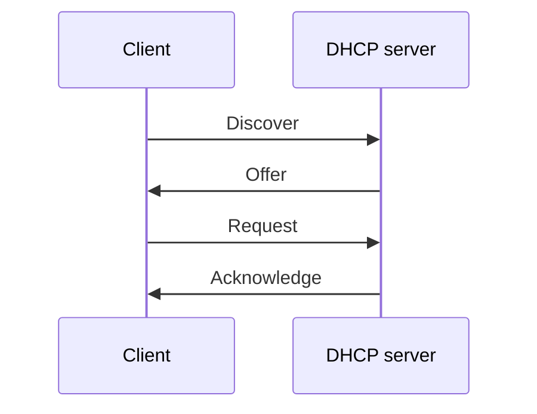
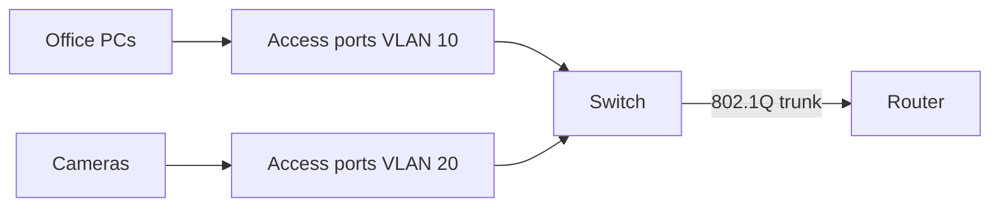

# Network configurations (Objectives 2.4, 2.6)

One mistyped number can stop a whole path.

## DHCP — Dynamic Host Configuration Protocol

Automatic hand-out of an **IP address** (the numeric address), **subnet mask**, **default gateway** (the router out of your network), and **DNS** server addresses.

**DORA** four-step dance:

1. **Discover** — client shouts: I need an address.
2. **Offer** — server: you may use this address.
3. **Request** — client: I will take that one.
4. **Acknowledge** — server: it is yours for the **lease** time.

- **Scope:** pool of addresses the server may give out.
- **Lease:** how long the client may keep the address; it tries to renew about halfway through.
- **Reservation:** this network-card hardware address always gets the same IP (printers).
- **Static / excluded:** addresses you set by hand; keep them out of the pool.
- **APIPA** (Automatic Private IP Addressing): **169.254.x.x** if no server answers. Talks only on the local cable; no internet.
- Routers do not forward DHCP shouts. A **relay** (IP helper) forwards them to a server on another subnet.

## DNS — Domain Name System

Phone book of the internet. People type names; packets use numbers.

Hierarchy: root → **TLD** (top-level domain, such as .com) → organisation name → host such as www.
**FQDN** (fully qualified domain name) example: `www.diontraining.com.`

- **Recursive** lookup: your resolver does the whole hunt (what your PC asks of 8.8.8.8).
- **Iterative** lookup: each server says “I do not know; ask that other server.”

**TTL** (time to live) = how many seconds a cached answer may be reused. Flush a stale cache with `ipconfig /flushdns`.

### Record types

| Record | Meaning |
|--------|---------|
| **A** | Name → IPv4 address |
| **AAAA** | Name → IPv6 address |
| **CNAME** | This name is an alias of another name |
| **MX** | Mail server; **lower** preference number = higher priority |
| **TXT** | Free text; used for mail proof and domain proof |
| **NS** | Which servers own this zone |
| **PTR** | Address → name (reverse lookup) |

Mail safety records (all stored as text in DNS):
- **SPF** (Sender Policy Framework): list of servers allowed to send mail for the domain.
- **DKIM** (DomainKeys Identified Mail): cryptographic seal; public key lives in DNS.
- **DMARC**: what to do if SPF or DKIM fail (do nothing / quarantine / reject).

Think: guest list (SPF), wax seal (DKIM), standing order for fakes (DMARC).

## VLAN — virtual local area network

Several logical networks on one physical switch. Broadcasts stay inside their virtual LAN.

- **802.1Q** tag rides on frames that leave a **trunk** port (switch to switch, or switch to router).
- **Access** port = one virtual LAN, no tag toward the PC.
- **Native VLAN:** untagged traffic on a trunk. Do not leave it as virtual LAN 1 in production.

Why: keep cameras off the office network, shrink broadcast noise, apply different rules.

## VPN — virtual private network

Encrypted tunnel across an untrusted network (usually the internet).

- **Site-to-site:** office router to office router, always on.
- **Client-to-site:** laptop app into the office.
- **Clientless:** browser portal.
- **Full tunnel:** all traffic goes through the office.
- **Split tunnel:** only office addresses go through the tunnel; the rest uses local internet.

## Small office / home office router

Find the **default gateway** (`ipconfig`) — often 192.168.0.1 or 192.168.1.1 — and open it in a browser.

Typical pages: WAN settings from the ISP, LAN address plus DHCP pool, Wi-Fi name and WPA2/WPA3, **port forwarding** (send one incoming port to an internal machine), **DMZ** (one host gets almost all inbound — high risk), **DDNS** (a name that follows a changing home address), **QoS** (quality of service — voice first), firmware update, admin password, remote admin off.
