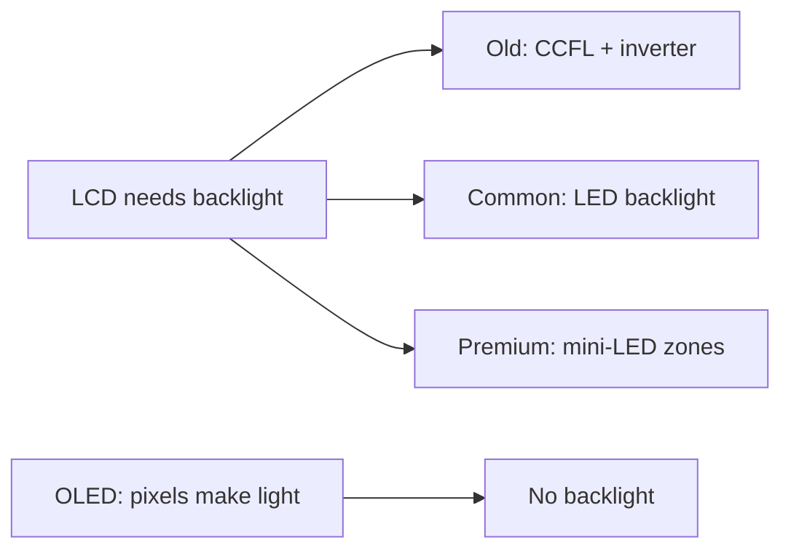

# Laptops and mobile devices (Objectives 1.2 and 3.1)

CompTIA **mobile device** = anything portable: laptop, phone, tablet, watch, glasses.

## Touch

- **Capacitive:** finger changes an electric field. Cheap; older ones were single-touch.
- **Multi-touch:** several fingers at once (pinch-zoom, two-finger scroll). Standard on phones and tablets.

The **digitizer** is the layer under the glass that turns a touch into digital input. **Haptic feedback** = tiny vibration so a virtual key feels real. Cover glass is often toughened (Gorilla Glass style).

## Display technologies

**LCD** (liquid crystal display): crystals twist to pass or block light. Needs a **backlight**.
- Old backlight: **CCFL** (cold-cathode fluorescent lamp) + **inverter** (turns battery DC into AC for the lamp).
- Modern: **LED** (light-emitting diode) backlight on the same LCD sandwich. Runs on DC, thinner, less power.

LCD panel flavours:

| Short name | Full name | Strength | Weakness |
|------------|-----------|----------|----------|
| **TN** | Twisted nematic | Fast (games) | Weak colours and viewing angles |
| **IPS** | In-plane switching | Wide angles (~178°), good colour | Cost |
| **VA** | Vertical alignment | Deep blacks / contrast | Slower than TN, narrower than IPS |

**OLED** (organic light-emitting diode): each pixel makes its own light. True black (pixel off), thin, can bend. Weaker in bright sun. **Burn-in** = a ghost of a static icon after months.

**Mini-LED:** thousands of tiny backlight zones on an LCD. Contrast closer to OLED, still a backlight.

## Display attributes

- **PPI** (pixels per inch): density. High PPI looks sharp (“retina” marketing = you cannot see individual pixels at normal distance). Costs battery and graphics work.
- **Refresh rate** in **hertz** (Hz): how many times the picture redraws per second. 60 Hz is fine for office work. 120 / 144 / 240 Hz looks smoother in games if the graphics chip can keep up.
- **Resolution:** pixels across × down. 1920×1080 = 1080p. 3840×2160 = 4K. 7680×4320 = 8K. Same 1080p looks fine on a 15-inch laptop and chunky on a 65-inch TV.
- **Colour gamut:** how many colours. **sRGB** = everyday. **Adobe RGB** and **DCI-P3** = photo / video work. **HDR** (high dynamic range) = brighter highlights and deeper darks when the content and the panel both support it.

## Motion sensors

- **Accelerometer:** speed, shake, tilt on X and Y (left-right, up-down). Rotates the screen. Parks a spinning hard disk if the laptop is falling. Steering in simple games.
- **Gyroscope:** adds the Z axis (toward / away). Pitch, roll, yaw. Flight games, 3D photos, camera shake reduction, shake-to-shuffle gestures.

## Accessories

Trackpad, **TrackPoint** (the red nub between keys), drawing tablet, **stylus**, mic, speakers, webcam, headset.

## Wireless on the device

Wi-Fi speed is limited by the **slower** of the phone/laptop radio and the access point. Bigger devices hold bigger antennas, so a tablet often holds a signal better than a phone.

**Cellular:** **SIM** (subscriber identity module) on **GSM** networks; old **CDMA** phones were locked to a carrier in the handset. **eSIM** is a downloadable profile. **PRL** (preferred roaming list) = which towers your carrier allows; phones usually update it alone (`*228` on some older CDMA units).

**Airplane mode:** always kills the cellular radio. On many modern phones you can turn Wi-Fi and Bluetooth back on after.

**Bluetooth:** pair in discoverable mode; confirm a PIN (often 0000 or 1234) or a six-digit match. Test with music or a call.

**NFC:** 2–8 inches. Payments (Apple / Google / Samsung Pay) and tap-to-pair. Too short for a headset in your pocket.

## Wired connectors

- Apple phones (older): **Lightning** (reversible 8-pin).
- Modern phones, iPads, many laptops: **USB-C**.
- Older Android: **USB micro-B** or **mini-B**.
- Laptop extras: HDMI, DisplayPort, Thunderbolt, 3.5 mm audio, **RJ45** network.
- **DB9 serial** (nine-pin D plug): old console port. Use a USB-to-serial adapter + rollover cable on a router. Android **UART** (universal asynchronous receiver/transmitter) is a software serial channel for developers.

## Port replicator versus docking station (exam distinction)

| | Port replicator | Docking station |
|--|-----------------|-----------------|
| What you get | Copies of ports the laptop already has, in one plug | Those ports **plus extras** (wired network, extra disk, optical drive, extra video) |
| Why | One cable instead of five at the desk | Turns a thin laptop into a desktop |

Some phones (Samsung DeX style) can dock to a monitor, keyboard, and mouse and act like a small desktop.

In the field people say “dock” for both. On the exam, keep the difference.
