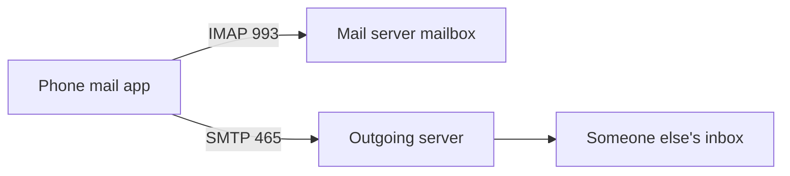

# Mobile applications (Objective 1.3)

Configure network bits on a phone/tablet and support the apps.

## Two mobile operating systems

| | **Android** (Google) | **iOS** / iPadOS (Apple) |
|--|----------------------|--------------------------|
| Source | **Open source** — makers can change the look (Kindle Fire still has Android underneath) | **Closed source** — only Apple hardware |
| Apps | **Google Play** plus other stores (Amazon, and so on) | **Walled garden:** only the App Store unless you **jailbreak** (voids support) |
| Build apps | Java / Kotlin in Android Studio | Swift in Xcode |

Open source = recipe you can change. Closed source = bakery pie, no recipe.

## Sync (keep the same data on phone, tablet, laptop)

Cloud accounts:
- Microsoft 365 + **OneDrive**
- Google Workspace / Gmail + Google Drive
- Apple **iCloud** (@icloud.com / @me.com)

What usually syncs: contacts, calendar, mail, photos, music, video, documents, apps, passwords.

- Contacts: one person = one **vCard**. Whole book = **CSV** (comma-separated values) file.
- Calendar: cloud, or an **iCalendar** file.
- Mail: **POP3** (Post Office Protocol 3) downloads and often deletes from the server — bad if you use many devices. **IMAP** (Internet Message Access Protocol) or **Exchange** keep read/unread and folders in sync.
- Passwords: browser store, or a vault (Bitwarden, 1Password, LastPass) that works on every platform.

## Company control

- **MDM** (mobile device management): the company owns or enrols the **whole device** — wipe, lock, force encryption, push Wi-Fi.
- **MAM** (mobile application management): control **only the work apps** on a personal phone (container, remote wipe of work data only).

## MFA — multi-factor authentication

Need **two different types**:

1. Something you **know** (password, PIN)
2. Something you **have** (phone, token, smart card)
3. Something you **are** (fingerprint, face)
4. Something you **do** (signature, voice pattern)
5. Somewhere you **are** (GPS / office network)

Password + SMS code is the usual pair.

## Location

| Type | How | Accuracy |
|------|-----|----------|
| Coarse | Three nearby **cellular towers** (triangulation) | Neighbourhood |
| **GPS** (Global Positioning System) | Three or more satellites | Metres outdoors |
| **IPS** (indoor positioning system) | Bluetooth / RFID beacons + Wi-Fi | Aisle in a shop |

**Geo-tracking** = path over time. **Geotagging** = GPS written into a photo. Turn camera location off if you post pictures publicly. Some companies use location as an extra login check.

## Email on the phone (exam favourite)

**Inbound** (receive): POP3 or IMAP. **Outbound** (send): **SMTP** (Simple Mail Transfer Protocol).

| Protocol | Clear port | Encrypted port (SSL/TLS) |
|----------|------------|--------------------------|
| POP3 | 110 | **995** |
| IMAP | 143 | **993** |
| SMTP | 25 | **465** (or 587 on many servers) |

**SSL** (Secure Sockets Layer) is the old name; **TLS** (Transport Layer Security) is what you should pick.

Big providers (Gmail, Outlook, Yahoo) **auto-configure** from the address. Company mail is usually **manual**: incoming host, outgoing host, username, password, TLS on, correct ports. Prefer IMAP if the user has more than one device.

