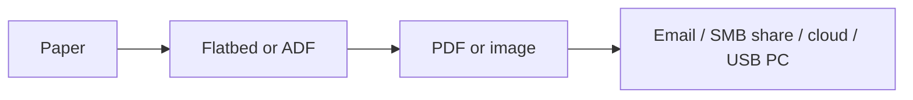

# Printers and multifunction devices (Objective 3.7)

**MFD** (multifunction device) = print + scan (+ copy, sometimes fax).

## Unbox and place

Big floor units can weigh hundreds of kilograms — two people or a dolly. Cut the carton away; do not deadlift the box. Remove shipping tape on the head / drum. Let a hot or cold unit **sit 1–2 hours** so condensation dries.

Place near power and a network jack, on a surface that can take the weight, with airflow (toner fumes). Not in a doorway. Shared office: somewhere everyone can walk to. Sensitive jobs: hold-and-release print so pages are not left in the tray.

## How it connects

- **USB:** Type-B on the printer, A or C on the PC. Plug-and-play drivers.
- **Wired Ethernet:** RJ45 (or fibre). Built-in print server + **DHCP** or a static address. Web page at that address for ink levels.
- **Wi-Fi infrastructure:** same as Ethernet, but radio to the office access point.
- **Wi-Fi Direct:** printer is its own access point; laptop joins that SSID.
- **Bluetooth:** cable-free one-to-one, like a short USB.

Prefer wired or infrastructure Wi-Fi for a shared office printer.

## Drivers and firmware

The **driver** on the PC turns a document into dots the engine understands. Install from the vendor site (admin rights). Windows Update can refresh it. Uninstall from Settings → Printers or Device Manager.

**PDL** (page description language):
- **PCL** (Printer Command Language) — HP family, rich features.
- **PostScript** (Adobe) — same output on any PostScript printer; publishers like it.
- Windows also has **XPS**; **PDF** is the portable file you already know.

Colour on paper is **CMYK**, not screen RGB.

**Firmware** lives **in the printer**. Update from the vendor; **do not power off mid-flash**.

## Settings you will touch

Printer **Properties** = the device. Print **Preferences** = this job.

- **Duplex** = both sides.
- **Orientation** = portrait or landscape.
- **Trays** = letter vs legal vs letterhead; paper **weight** is pounds per 500 sheets.
- **Quality** = draft / normal / photo; greyscale to save colour.
- **Finishing** = staple, punch (big MFDs).

Advanced tab can limit hours or hold huge jobs until evening.

## Sharing

- **Print server:** dedicated box (or software on Windows/Linux) that queues jobs for many printers. Scale for a whole company. Windows **Print Management** MMC.
- **Printer share:** USB printer hung off one PC. That PC must stay on. Fine at home.
- Embedded server in a modern network printer: fine up to tens of users.

**Spooler:** the service that stores jobs on disk and feeds the printer. If jobs stick, restart the spooler; check free disk space.

## Security

- Permissions: print vs manage printer vs manage documents. Least privilege. Accounting only prints to the accounting MFD.
- **Audit log:** who printed what and when. Can feed a **SIEM** (security information and event management) box.
- **Secure print / hold print:** job waits until the user types a PIN or taps an **RFID** badge at the panel.
- Badging is safe but slow for 300-page jobs — the engine does not start until you arrive.

## Scanning on an MFD

- **Flatbed:** glass + moving bar. One page or a book.
- **ADF** (automatic document feeder): drop a stack. Better units scan **both sides** in one pass.
- **OCR** (optical character recognition): picture of text becomes editable words.

Where the file goes: local disk (USB MFD), **SMTP** email, **SMB** share folder, or cloud (OneDrive, Google Drive, Dropbox, iCloud).

