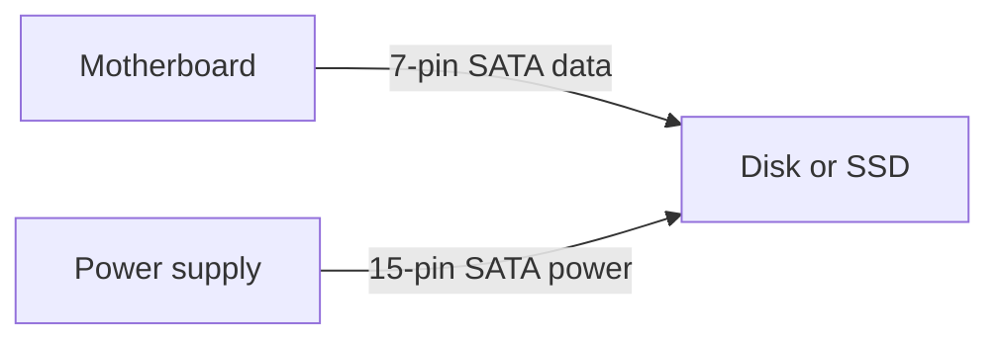

# Storage devices (Objective 3.4)

Yellow tab: **Storage Devices**.

- **HDD** — hard disk drive (spinning platters).
- **SSD** — solid-state drive (flash, no moving parts).
- **RAID** — redundant array of independent disks (several disks acting as one logical disk).

## Physical sizes

| Size | Typical use |
|------|-------------|
| 1.8 inch | Tiny old ultraportable disks (rare now) |
| 2.5 inch | Laptops and many SSDs |
| 3.5 inch | Desktop internal disks |
| 5.25 inch | Optical drives, old tape / floppy bays |

## How a hard disk writes

A metal or glass **platter** is coated with a magnetic layer. A **read/write head** on an **actuator arm** flies just above the surface.

- **Track** = one circle around the platter.
- **Sector** = a slice of that track. Classic size **512 bytes**.
- **Seek** = move the head. Speed of the platter is **RPM** (revolutions per minute).

| RPM | Role |
|-----|------|
| 5 400 | Slowest, cheap / low power |
| 7 200 | Common desktop |
| 10 000 | Faster, more money |
| 15 000 | Fastest spinning class — highest cost, more heat |

**Buffer / cache** on the drive stores recent blocks so the next read is faster.

## Solid-state drives

No platters, no seek time, no moving parts. Faster and more durable than spinning disks. Cost more per gigabyte.

Three common shapes:

1. **2.5 inch** SATA box — drop-in laptop / desktop replacement.
2. **mSATA** — small card using SATA signalling (older laptops).
3. **M.2** — thin stick. Can speak SATA **or** **NVMe**.

**NVMe** (Non-Volatile Memory Express) rides **PCIe** (Peripheral Component Interconnect Express) through the M.2 slot. Much faster than SATA.

## SATA and PATA cables

**SATA** (Serial ATA) — thin 7-pin **L-shaped** data cable from board to drive. Separate 15-pin power from the power supply.

| Marketing name | Max throughput |
|----------------|----------------|
| SATA I (1.5) | 1.5 gigabits per second |
| SATA II (3) | 3 gigabits per second |
| SATA III (6) | 6 gigabits per second |

**PATA** (Parallel ATA), also called **IDE** (Integrated Drive Electronics) — old wide **ribbon** cable. 40-pin or 80-conductor (80-wire has extra grounds and is faster). Master / slave jumpers: two devices on one cable. Length about **46 cm / 18 inches**. Replaced by SATA everywhere except some legacy / industrial gear. Used for hard disks, optical drives, and old ZIP / tape boxes.

