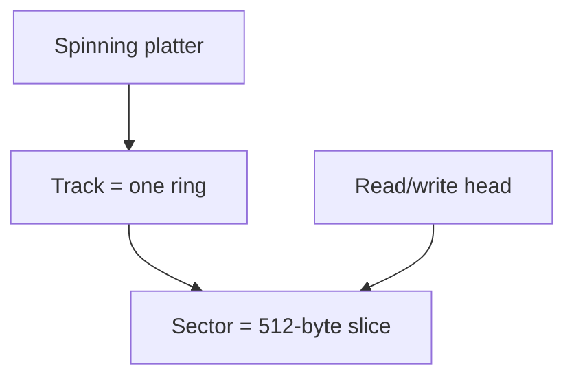

# Storage devices (Objective 3.4)

Yellow tab: **Storage Devices**.

- **HDD** — hard disk drive (spinning platters).
- **SSD** — solid-state drive (no moving parts).
- **RAID** — redundant array of independent disks (several disks acting as one, for speed or safety).

## Physical sizes

| Size | Typical use |
|------|-------------|
| 2.5 inch | Laptop disks and many SSDs |
| 3.5 inch | Desktop internal disks |
| 5.25 inch | Optical drives, old tape and floppy bays |

Adapters exist to mount a smaller drive in a larger bay.

## How a hard disk writes

A metal or glass **platter** is coated with a magnetic layer. A **read/write head** on an **actuator arm** flies just above the surface and flips magnetic bits.

- A **track** is one circle around the platter.
- A **sector** is a slice of that track. Classic sector size is **512 bytes** (newer drives may use 4 kilobyte sectors).
- Track count and density change with the platter design.

**Seek** = move the head to the right track. Speed of the platter is **RPM** (revolutions per minute).

| RPM | Role |
|-----|------|
| 5 400 | Slowest, cheap office / low-power |
| 7 200 | Common desktop — faster, still affordable |
| 10 000 | High performance, costs more, often in gaming / workstation boxes |
| 15 000 | Fastest spinning class (enterprise, rare in home PCs) |

An SSD has no RPM. It is limited by the flash chips and the controller, not by a motor.
