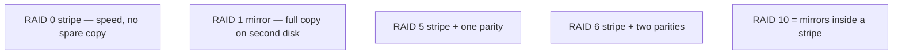

# RAID levels (part of Objective 3.4)

**RAID** = Redundant Array of Independent Disks. Several physical disks appear as one logical disk to the operating system. Exam levels: **0, 1, 5, 6, 10**.

| Level | How it writes | Disks (minimum) | If one disk dies | Space you keep |
|-------|---------------|-----------------|------------------|----------------|
| **0** stripe | Block 1 on disk A, block 2 on disk B, … | 2 | **All data gone** | 100% |
| **1** mirror | Every write is copied to the second disk | 2 | Keep working from the copy | 50% |
| **5** parity | Data striped; one disk-worth of **parity** (error math) | 3 | Rebuild from parity | About n−1 |
| **6** double parity | Two parity sets | 4 | Survive **two** dead disks | About n−2 |
| **10** (1+0) | Two RAID 1 pairs striped | 4 | Can lose one disk in each pair | 50% |

Words used on the exam:

- **Failure resistant** — RAID 1 or 5: a copy or parity exists so erased / dead-disk data can be rebuilt.
- **Fault tolerant** — RAID 1, 5, or 6: the array **keeps running** after a disk fails.
- **Disaster tolerant** — RAID 10: two independent sides; you can lose half the array and the other half still works.

RAID 0 is **only** for speed. Do not put the only copy of important files on RAID 0.
